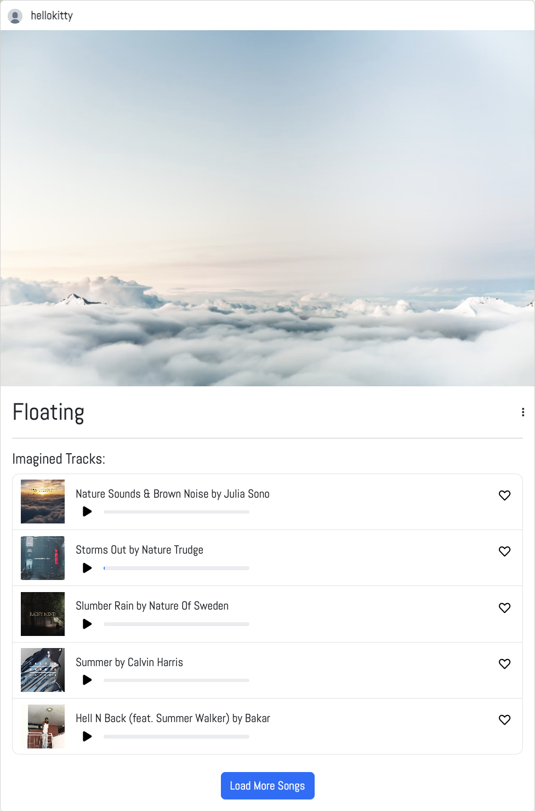
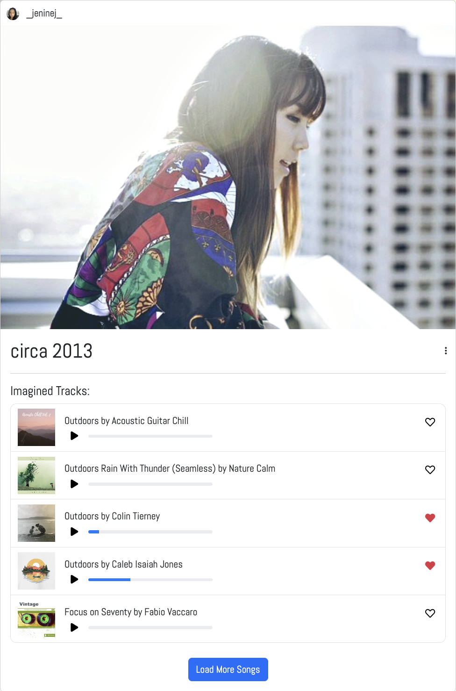

# Imagime

Imagime is a image-to-music discovery app that allows users to upload their own photos and through the power of AI, get song recommendations tailored to the visual content of the image. Whether you're looking for the perfect track to accompany your latest photo or simply want to explore new music in a more personalized way, Imagime offers a fresh and innovative approach to music exploration.

# Deployment

## To use Imagime, visit [Imagime](https://imagime.onrender.com)

## Features

- **Image-Based Music Recommendations**: Upload an image, and Imagime will suggest songs that match the mood, theme, or elements within your photo.
- **Favorite Tracks**: Users and other users can explore tracks and save them to their favorite list, as well as see what others have favorited.
- **Profile Customization**: Users can edit their profiles, including uploading profile pictures and updating their bio.
- **Responsive & User-Centered**: Easily navigate through the app whether on a desktop or smaller screens.

### Social Interaction Features

- **Subtle Social Engagement**: Imagime allows users to like songs linked to other users' posts without direct interaction, offering a more passive and comfortable form of social engagement.
- **Increased Engagement**: Users can appreciate and like songs across the platform, potentially increasing overall engagement within the app.
- **Broader Social Experience**: Connect with others through shared musical discoveries, fostering a sense of community without the need for direct communication
- **Consistency**: Provides a uniform user experience where all songs are open for interaction, maintaining a consistent and inclusive environment for all users.

  
  

### How It Works:

1. **Sign Up**: Create an account to start using the app.
2. **Upload an Image**: Click the 'New Post' link in the navbar, upload an image or provide a URL, and let the app generate song recommendations.
3. **Explore Songs**: Browse the list of songs, listen to previews, and like your favorites.
4. **Manage Profile**: Update your profile with a custom image and bio and optionally delete your account.

## Why Imagime?

### Personalized Discovery
Imagime uses images as a starting point to generate song recommendations. This adds a layer of personalization that traditional music platforms don’t offer. Instead of searching for specific songs or genres, users can discover new music that matches the mood, theme, or elements in their photos, leading to serendipitous discoveries they might not have found otherwise.

### Visual-Audio Connection
The app taps into the connection between visuals and music. For creative individuals, photographers, and those who enjoy visual storytelling, Imagime bridges the gap between imagery and sound, creating a more immersive experience. This can be particularly appealing for users who enjoy pairing music with visual content, such as in social media posts or personal projects.

### Social Discovery
By allowing users to see what others have liked, Imagime fosters a subtle form of social interaction. Users can explore music favored by others, adding a layer of communal discovery that is more passive and less direct than following or sharing playlists on other platforms.

### Unique Use Case
Imagime’s approach makes it ideal for people looking for thematic music—for instance, someone creating a photo slideshow, working on a video project, or curating a specific mood for an event. It provides a quick and intuitive way to find music that fits a specific aesthetic or theme without needing extensive musical knowledge.

### Curated Experience
The app can serve as a curation tool for users who prefer not to spend time searching and filtering through vast libraries of music. Instead, they receive tailored recommendations based on their personal images, making the process more streamlined and enjoyable.

### Bringing Visual Art and Music Together
In essence, Imagime is not just about finding music; it’s about creating an experience that combines visual art with auditory exploration, offering a novel and engaging way to discover new music.

## Stretch Goals

- **Enhanced Search**: Implement advanced filtering and searching options for song recommendations.
- **Community Features**: Enable users to share their favorite image-song pairings with other users, fostering a collaborative discovery experience.
- **Improved Mapping Algorithms: Work towards generating more accurate mappings between images and songs.
- **Expanded Music Library & Functionality**: Include a broader range of music sources beyond Spotify and provide playlist options with a more sophisticated audio player experience.

## API's Used

- **[Everypixel API](https://labs.everypixel.com)**
- **[Spotipy API](https://spotipy.readthedocs.io/en/2.24.0/)**